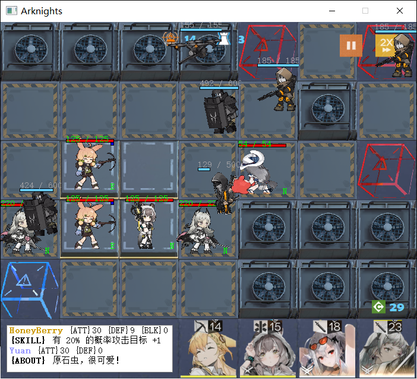

# Arknights

## 项目简介

> **一个基于 Qt5 的类《明日方舟》塔防游戏**

## 游戏指南

- 放置干员：首先**左键单击**右下角干员头像，然后再**左键单击**战场中适当位置的方格，向上/下/左/右**拖动**后释放鼠标。
  - 干员的朝向会以 N/S/W/E 的绿色字母显示在小人右下角。

- 撤退干员：鼠标**右键单击**战场上的干员。
  - 撤退干员的同时会返还一半的费用。

- 显示单位信息：鼠标**左键单击**战场上任意我方单位或敌方单位。
  - 会在左下角打印其基本信息。若选中的是我方单位，还会显示其攻击范围。
  - 此外，每个干员都有独特的被动技能，发动时会在其右上角有蓝色小方块标识。

## 感谢

- 所有我方干员及敌方单位的素材，来源于明日方舟wiki: https://prts.wiki/

- 两张内置地图的怪物移动路径，来源于: https://map.ark-nights.com/

## License

MIT license.
